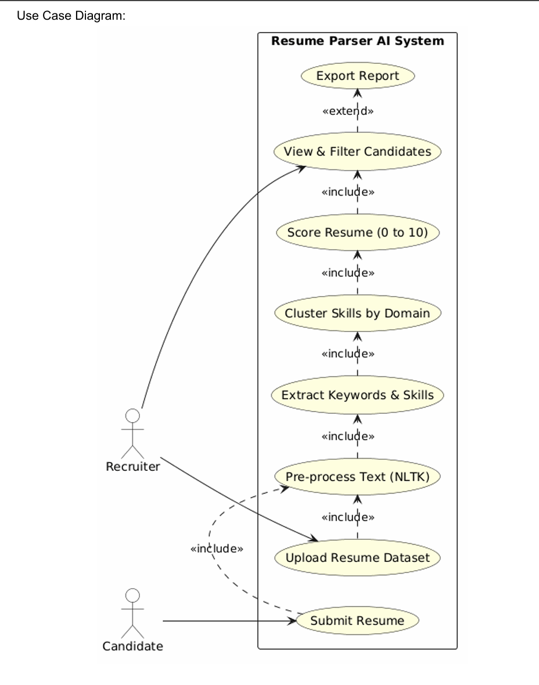
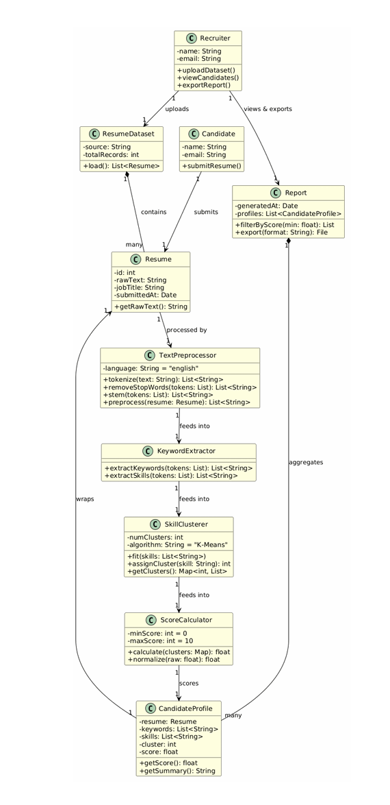

# Lab 14: Resume Parser 

## Use Case Diagram

## Class Diagram

## Completed Use Case: Upload Resume Dataset

The use case completed in this iteration is **Upload Resume Dataset**.

A Recruiter calls upload_dataset(), which loads a CSV file of resumes using the ResumeDataset class and returns a list of Resume objects. This is the entry point for the entire pipeline: without the dataset being uploaded and parsed, none of the downstream steps (text preprocessing, keyword extraction, skill clustering, or scoring) can run.

The ResumeDataset class in src/models/resume_dataset.py reads data/resumes.csv and constructs a Resume object for each row. The Recruiter class in src/models/recruiter.py calls this through upload_dataset(), and main.py wires it together before passing the results into Pipeline.run().

To run the project:

    pip install -r requirements.txt
    python main.py
